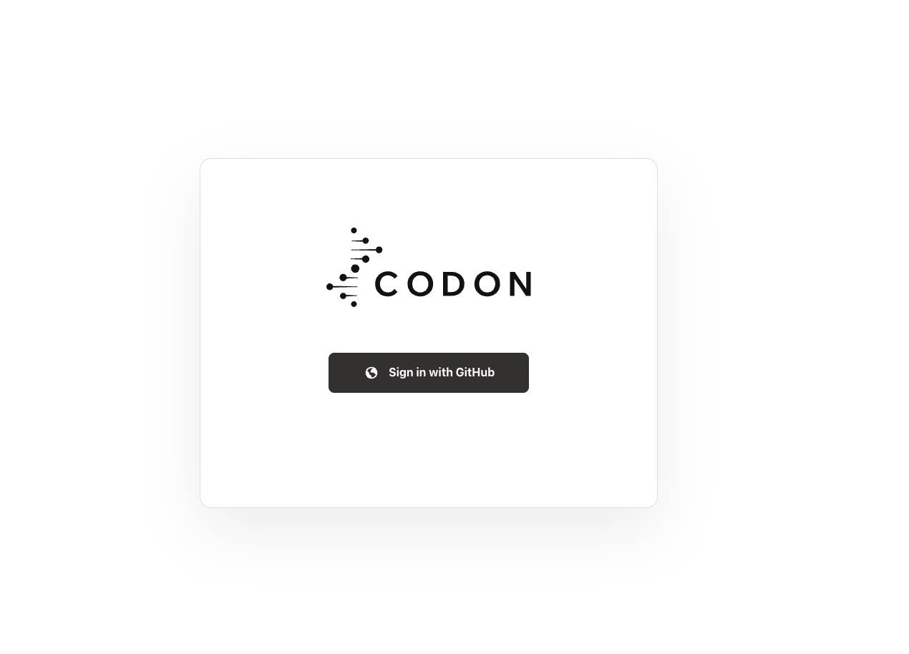
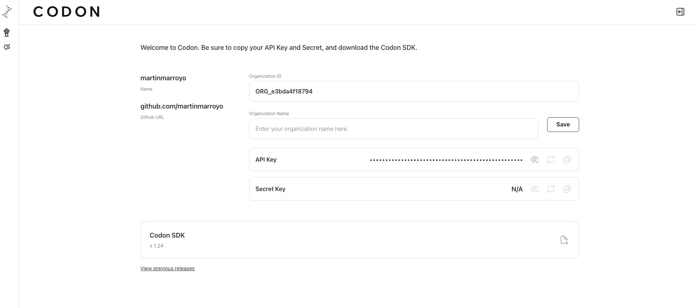
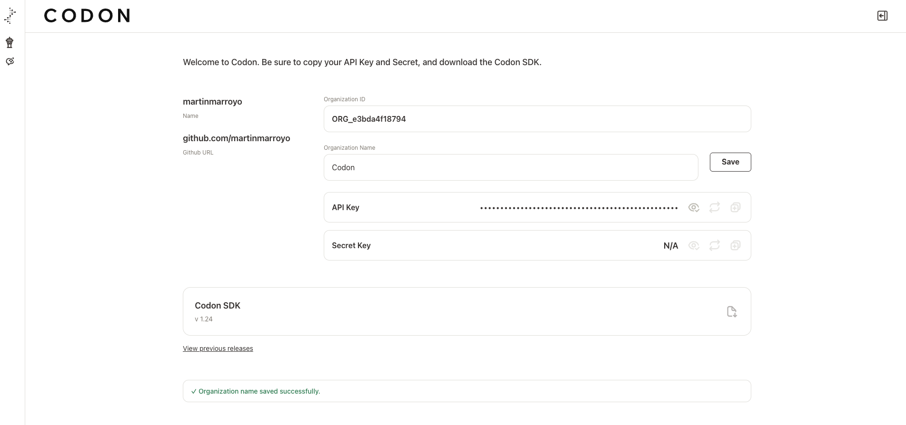

# Getting Started

## Prerequisites
- Python 3.9 or newer
- `pip`

**Source code:** [Codon SDK on GitHub](https://github.com/Codon-Ops/codon-sdk)

## Platform Setup

To access the Codon observability platform and export telemetry data, you'll need to create an account and obtain an API key.

### Step 1: Access the Login Screen

Navigate to the Codon platform and click 'Sign in with Github':



### Step 2: Authorize with GitHub

You'll be redirected to GitHub to authorize the Codon application:


### Step 3: Access Your Dashboard

After authorization, you'll be redirected to your organization dashboard:



Your dashboard will display your organization ID, name, email, and API key.

### Step 4: Configure Your Organization

Add or update your organization name and save your settings:



**Important:** Copy your API key and set it as the `CODON_API_KEY` environment variable to authenticate telemetry exports to the Codon platform.

## Installation

Install the Codon SDK from PyPI:

```bash
pip install codon-sdk
```

For framework-specific integrations, install the corresponding instrumentation packages:

```bash
# LangGraph integration
pip install codon-instrumentation-langgraph
```

## Environment Configuration
| Variable | Purpose |
| -------- | ------- |
| `ORG_NAMESPACE` | Required by `NodeSpec` and instrumentation to scope identifiers. |
| `CODON_API_KEY` | Required to export telemetry data to the Codon observability platform. |
| `OTEL_SERVICE_NAME` | Default service name for telemetry (overridden by service_name parameter). |
| `OTEL_EXPORTER_OTLP_ENDPOINT` | Configure custom OTLP collector endpoint. |

Set `ORG_NAMESPACE` before constructing `NodeSpec` objects or instrumented decorators will raise a validation error.

You can set these environment variables directly:

```bash
export ORG_NAMESPACE=your-org-name
export OTEL_SERVICE_NAME=your-service-name  # default service name
export OTEL_EXPORTER_OTLP_ENDPOINT=http://localhost:4317
export CODON_API_KEY=your-api-key-from-dashboard  # required for telemetry on Codon platform
```

Or create a `.env` file in your project root:

```bash
# Required
ORG_NAMESPACE=your-org-name

# Optional - default service name (overridden by function parameter)
OTEL_SERVICE_NAME=your-service-name
OTEL_EXPORTER_OTLP_ENDPOINT=http://localhost:4317

# Required for captured telemetry visible on Codon platform
CODON_API_KEY=your-api-key-from-dashboard
```

## Initializing Telemetry

Once you have your API key configured, initialize telemetry to start sending observability data to the Codon platform:

```python
from codon_sdk.instrumentation import initialize_telemetry

# Initialize telemetry - uses CODON_API_KEY automatically
initialize_telemetry()
```

Call `initialize_telemetry()` once at the start of your application, before creating workloads or executing agents. This function:

- Configures OpenTelemetry to export spans to the configured endpoint (via `OTEL_EXPORTER_OTLP_ENDPOINT`)
- Automatically uses your `CODON_API_KEY` environment variable for authentication (can be overridden with `api_key` parameter)
- Uses `OTEL_SERVICE_NAME` for service identification, with function parameter taking precedence
- Works for both [from-scratch workloads](building-from-scratch.md) and [framework integrations](instrumentation/langgraph.md)

**Example with service name:**
```python
initialize_telemetry(service_name="my-ai-agent")
```

## Next Steps

Now that you have the SDK installed and configured, you can:

- **Build from scratch**: Create custom agents with [CodonWorkload](building-from-scratch.md)
- **Use existing frameworks**: Integrate with [LangGraph](instrumentation/langgraph.md) or other supported frameworks
- **Learn the APIs**: Explore detailed documentation in the [API Reference](api-reference.md)

For detailed information about NodeSpec and Logic ID generation, see the [API Reference](api-reference.md).