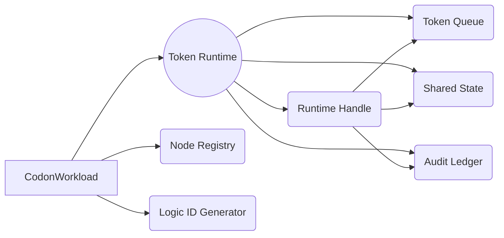

# Codon Workload Design Philosophy

Codon Workload is the heart of our emerging agentic framework. This document describes the principles that guide its design, what it can already do today, and the roadmap for the capabilities we intend to add. It aims to speak to both engineering teams and collaborators who need to understand the framework’s behaviour at a higher level.

---

## Guiding Principles

1. **Portability Over Infrastructure Lock-In**  
   Workloads must remain portable across environments. The same logic graph should run locally, in CI, or in production without re-authoring code. Runtime concerns (telemetry, persistence, scaling) should be injectable, not baked into agents.

2. **Audit First**  
   Every agent run should be replayable. Provenance—who emitted a token, when, with which payload—needs to be preserved. This is not just a compliance checkbox; it is foundational for trust, debugging, and postmortems.

3. **Composable Runtime**  
   The framework provides a default execution engine, but its components (token queues, state store, audit sink) are intended to be swappable. Teams should be able to plug in bespoke back-ends without rewriting agent logic.

4. **Graph Flexibility**  
   Agents are not restricted to DAGs. Feedback loops, streaming, and reactive behaviours are first-class. The runtime must therefore handle cycles and long-lived flows gracefully.

5. **Low Cognitive Load for Developers**  
   Authoring an agent should feel familiar: define functions, register them as nodes, wire edges. The runtime handles orchestration, tokens, and logging behind the scenes.

---

## What We Have Today

### Token-Based Execution
- Each node receives a token `message`, operates on it, and can emit new tokens to downstream nodes via `runtime.emit(...)`.
- Tokens carry immutable provenance: unique ID, lineage, parent link, timestamps, and origin node.
- Shared per-run state (`runtime.state`) allows nodes to coordinate while keeping logic in regular Python functions.

### Auditable Ledger
- Every enqueue, dequeue, node completion, custom event, and stop request is recorded as an `AuditEvent`.
- `ExecutionReport` bundles node results, the audit ledger, runtime context (`deployment_id`, `logic_id`, `run_id`), and helper methods for quick inspection.
- Developers can insert their own audit entries using `runtime.record_event(...)` to add business-specific metadata.

### Compliance-Focused Errors and Guardrails
- `WorkloadRegistrationError` highlights graph definition issues (duplicate nodes, missing edges).
- `WorkloadRuntimeError` covers invalid routing (emitting to unregistered nodes), step limit breaches, and unexpected node failures.
- `max_steps` can cap execution cycles to prevent runaway loops.

### Documentation & Tests
- Quickstart guide (`docs/guides/codon-workload-quickstart.md`) demonstrates node authoring, runtime features, and the audit ledger.
- Unit tests cover registration, routing checks, looping behaviour, state propagation, and ledger integrity.

---

## Roadmap Highlights

| Theme | Near-Term Goals | Longer-Term Exploration |
|-------|-----------------|-------------------------|
| **Persistence & Resumability** | Abstract token/state/audit storage; add pluggable `TokenStore`, `StateStore`, `AuditSink` interfaces; deliver a reference adapter (e.g. SQLite/Redis). | Broker-backed runtime (Kafka/SQS), resumable runs with checkpointing, multi-run conversation history. |
| **Observability** | OTEL integration that pairs audit ledger entries with span data; structured metrics for loop counts, token throughput. | Visual dashboards for token flow, real-time audit streaming to compliance tools. |
| **Developer Experience** | Runtime introspection helpers (e.g. live queue inspection), richer validation of node contracts, CLI scaffolding for workloads. | Graph IDE/visual editor, templated workloads for common agent patterns. |
| **Safety Controls** | Policy hooks to enforce org-specific constraints (e.g., allowed edges, token payload limits). | Formal verification of workload graphs; static analysis for identifying potential infinite loops or unbounded fan-outs. |

---

## Architectural Snapshot

- **Node Registry** keeps immutable `NodeSpec`s (function signature, metadata, generated IDs).
- **Runtime Handle** mediates node interactions: emit tokens, record events, access state, stop execution.
- **Token Queue / Shared State / Audit Ledger** currently live in memory but are designed for future persistence.
- **Logic ID Generator** produces deterministic hashes of the workload graph (unchanged from earlier implementations).

---

## Why This Matters

- **Transparency**: By default we capture the entire “tape” of an agent run. Teams can replay what happened, not just infer from logs.
- **Flexibility**: Agent authors are not boxed into DAG-only workflows. Loops, streaming, branching, and concurrent patterns are all viable.
- **Extensibility**: The framework is not tied to a single broker or storage engine. You can start with an in-memory runtime and graduate to production-grade infrastructure without refactoring agent logic.
- **Compliance Readiness**: We treat audit as a first-class feature, not an afterthought. As persistence lands, the logs will remain provable and verifiable across environments.

---

## Where We’re Headed Next

1. **Persistent Runtime Interfaces**  
   Introduce abstraction layers so tokens, state, and audit events can be stored in databases, brokers, or custom back-ends.

2. **Resume & Continue Runs**  
   Allow workloads to pause and resume across processes, unlocking continuous conversations and long-running agents.

3. **Telemetry Integration**  
   Align the runtime ledger with OpenTelemetry spans for a unified tracing story.

4. **Policy & Controls**  
   Expose hooks for governance teams to enforce routing rules, payload checks, and step limits at runtime.

5. **Developer Tooling**  
   Ship a CLI and/or UI for visualising workloads, running simulations, and inspecting audit trails interactively.

---

Codon Workload is intentionally opinionated about provenance and flexibility. By investing early in auditability and composable infrastructure, we’re building a foundation capable of supporting both experimental agents and production-grade, regulated workloads. The work ahead is to keep the developer ergonomics simple while expanding the runtime’s durability, observability, and policy enforcement.
